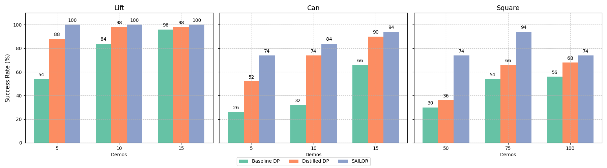
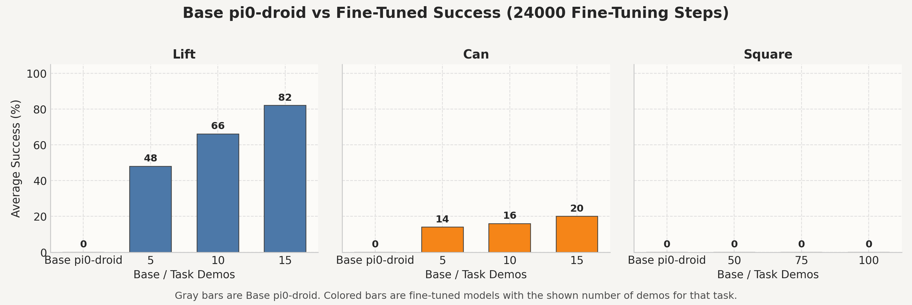
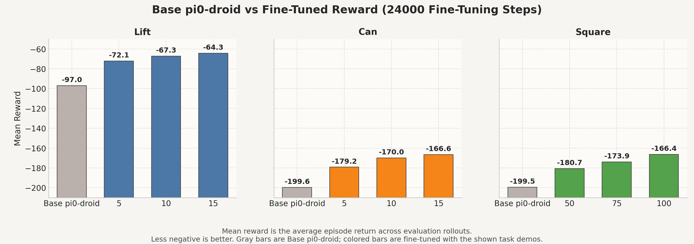
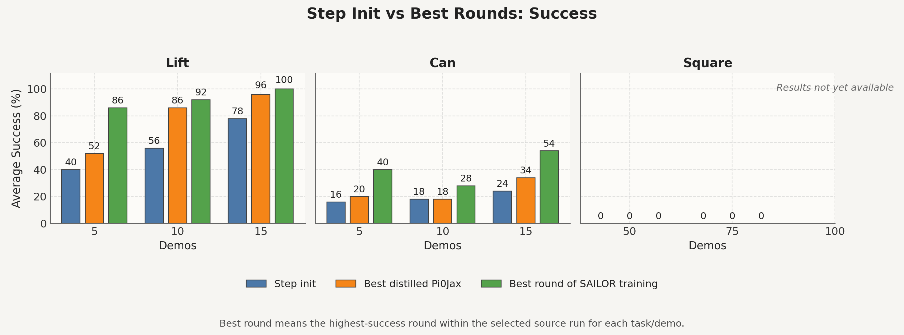
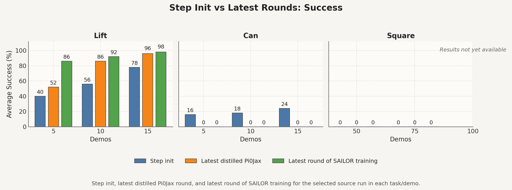
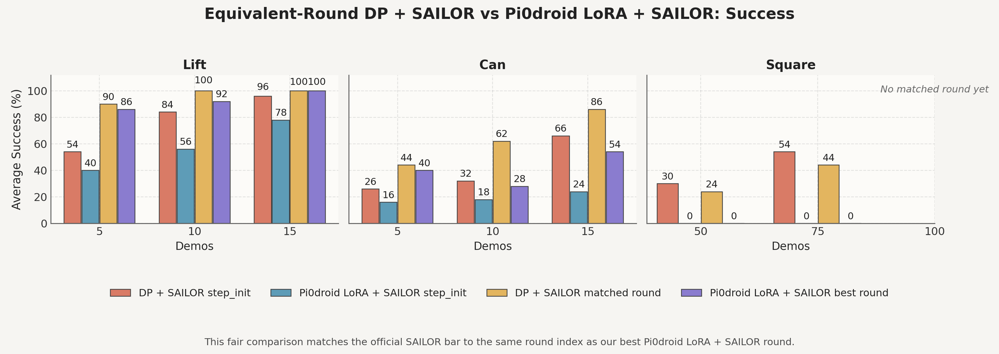
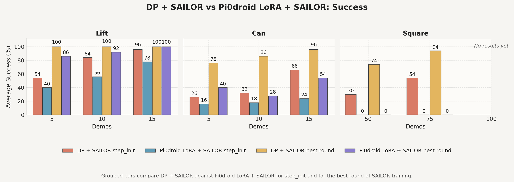

# Integrating Robot Foundation Models with Recovery-Based Control
## π₀-Droid + SAILOR for Robust Robotic Imitation Learning

This repository explores how to make robotic imitation learning more robust to execution errors and distribution shift by combining a pretrained **Vision-Language-Action (VLA)** policy with a **recovery-based search controller**. The project centers on integrating **π₀-Droid** into **SAILOR**, a latent-search recovery framework for robotic manipulation, and evaluating the result on RoboMimic manipulation tasks.

> The core question is simple: can a stronger pretrained robot policy provide better nominal actions inside a recovery-aware controller, while still benefiting from online search and correction?

---

## Why This Project Matters

Policies trained purely through behavioral cloning often work well near their training distribution, but can fail once execution drifts into unseen states. Recovery-based control addresses this by planning corrective actions online, while large pretrained VLA models offer broader visuomotor priors learned from more diverse robot data.

This project asks whether those two strengths can be combined in one system:

- a stronger pretrained base policy
- online recovery through latent-space search
- task-specific adaptation through fine-tuning

The final result is qualified but meaningful: the integration is real, the planner still helps on top of the stronger VLA base, and the main remaining bottleneck is now **optimization and training stability**, not basic interface compatibility.

---

## How to Read the Results

The project reports two complementary metrics throughout the README and thesis:

- **Success** is the main benchmark metric: the percentage of evaluation episodes that satisfy the task's success condition.
- **Mean reward** is the average episode return from the RoboMimic environment. In these tasks the values are negative, so **less negative is better**.

The reward figures matter most on harder settings where binary completion stays low or zero. In those cases, reward shows whether the policy is still making **partial progress toward the goal** even when it does not yet complete the task inside the fixed episode horizon. This is especially important on **Square**, where the thesis results show improved behavior without reliable final insertion.

---

## Project Journey

The repository is organized around four milestones.

### 1. Reproducing the SAILOR Baseline

The first milestone was to reproduce the original SAILOR baseline on RoboMimic. This established a trusted reference point, validated the training and evaluation pipeline, and made the recovery loop understandable in practice before modifying anything.



This figure shows the reproduced baseline trend that the rest of the project builds on: the full SAILOR system outperforms the distilled base policy, especially as task difficulty increases. It matters because it establishes a trusted recovery-based reference before swapping in π₀-Droid as the new base policy.

### 2. Enabling π₀-Droid Inference in RoboMimic

The second milestone was to make π₀-Droid run correctly inside RoboMimic. This required aligning observations, camera inputs, controller semantics, joint-velocity execution, and gripper mapping so that a pretrained VLA model could act inside the simulator with the correct interface.

### 3. Task-Aligning π₀-Droid Through JAX LoRA Fine-Tuning

The third milestone was to adapt π₀-Droid to the RoboMimic task family. To make the comparison against the original SAILOR baseline fair, the pretrained VLA had to be task-aligned before recovery-based search was added on top. This was done through a JAX LoRA fine-tuning pipeline under practical one-GPU memory constraints.

### 4. Integrating π₀-Droid Into the Full SAILOR Loop

The final milestone was to replace SAILOR's original diffusion-policy base with π₀-Droid while preserving the rest of the recovery framework: world model, reward model, critic, search, and online update logic. At that stage, the project stopped being mainly an interface problem and became a full systems and optimization problem under long HPC runs.

---

## Results Gallery

### Fine-Tuning: Success at 24k Steps



This figure shows the main result of **Milestone 3**. Fine-tuning turns `π₀-Droid` from a mostly zero-shot prior into a much stronger task-aligned policy on **Lift**, with smaller but still consistent gains on **Can**. It matters because it establishes that the VLA base can be strengthened substantially before SAILOR is added.

### Fine-Tuning: Mean Reward at 24k Steps



This figure is the key companion to the success plot. For **Lift** and **Can**, the reward trend confirms that fine-tuning improves overall task progress, not just the number of episodes that barely cross the success threshold. For **Square**, it gives the more accurate story: binary success remains at zero, but mean reward improves substantially, showing progress without reliable completion.

Extended diagnostic fine-tuning results are also available at the longer budget: [48k success](scratch_dir/rollouts/plots_47999/ft_success_seed123_47999_res224_cam0.png) and [48k mean reward](scratch_dir/rollouts/plots_47999/reward_vs_pi0_droid_seed123_47999_res224_cam0.png). In the thesis these are treated as a follow-up analysis rather than the main benchmark result, because longer fine-tuning helped some settings but did not fundamentally close the remaining gap on **Square**.

### Integrated System: Best-Round Success



This is the clearest positive result of **Milestone 4**. It compares the integrated step-init checkpoint, the best distilled `Pi0Jax` round, and the best online SAILOR round within the selected run. The main story is that **search still adds value on top of the stronger VLA base**, especially on **Lift**, and more modestly on **Can**.

Paired mean reward view: [best_rounds_reward.png](comparison_exports/plots/best_rounds_reward.png). That reward figure matters because it shows the same best-round improvement through a denser metric and makes the partial-progress story on **Square** easier to see.

### Integrated System: Latest-Round Success



This figure asks the harder question: were the gains from the best round still present at the latest available checkpoint? It matters because these integrated runs were long and expensive; the latest-round view reveals the difference between a system that can become strong and a system that can remain stable.

Paired mean reward view: [latest_rounds_reward.png](comparison_exports/plots/latest_rounds_reward.png). In the thesis, the success and reward versions together are what show that **Lift** stays relatively healthy while **Can** can improve and then collapse later in training.

### Fair Baseline Comparison: Matched-Round Success



This is the fairest direct comparison against the diffusion-policy SAILOR baseline. The official `DP + SAILOR` result is compared at the same round index as the best `π₀-Droid LoRA + SAILOR` round. It shows that the reproduced diffusion-policy baseline remains stronger overall, but also that the integrated π₀-based system is already meaningful and competitive on **Lift**.

Paired mean reward view: [matched_round_vs_ours_reward.png](comparison_exports/plots/matched_round_vs_ours_reward.png). The reward comparison is useful because it shows that the remaining gap on **Can** and **Square** is not only about crossing the final binary success threshold; the official baseline is also making stronger task progress within the same round budget.

### Best-Available Comparison Against the Reproduced Baseline



This looser comparison places the strongest available diffusion-policy result against the strongest available π₀-based result. It is not the fairest view, but it is useful as an upper-bound gap figure: the integrated system is closest on **Lift**, farther behind on **Can**, and still clearly limited on **Square**.

Paired mean reward view: [official_vs_ours_reward.png](comparison_exports/plots/official_vs_ours_reward.png). The reward version makes the same benchmark-gap story more complete by showing that the reproduced `DP + SAILOR` system is usually not only more successful, but also more efficient throughout the episode.

---

## Main Contributions

- Reproduced the published SAILOR baseline on RoboMimic and established a trusted benchmark for later comparison.
- Built a working simulator/runtime bridge for **π₀-Droid** in RoboMimic, including observation alignment, controller adaptation, and gripper execution mapping.
- Developed a RoboMimic **JAX LoRA** fine-tuning pipeline for task-aligning the pretrained VLA model.
- Integrated **π₀-Droid** into the full SAILOR loop and showed that pretrained VLA priors can be meaningfully combined with search-based recovery.
- Identified that the main remaining bottleneck is now **optimization, stability, and training efficiency**, rather than simple incompatibility between the two systems.

---

## Benchmark Tasks

This project focuses on the RoboMimic portion of the benchmark setup because it provides a standardized and reproducible environment with fixed demonstration datasets and evaluation procedures. The three tasks used here are:

- **Lift**: grasp and lift a block above the table
- **Can**: pick and place a can into the correct bin
- **Square**: pick up a square nut and place it onto the matching peg

These tasks form a useful difficulty ladder from short-horizon grasping to precise recovery-heavy manipulation.

---

## Repository Structure

The repository currently contains both the VLA integration code and the generated result artifacts used in the thesis.

```text
.
├── README.md
├── Pierre_Ishak_Thesis_Integrating_VLA_Models_into_SAILOR.pdf
├── reproduced_results.png
├── pi0_action_contract.py
├── pi0_runtime_bridge.py
├── pi0_round_dataset.py
├── pi0_jax_update_runtime.py
├── train_pi0_droid_lora_robomimic.py
├── pi0_joint_vel_final_simple_fix_pytorch_lora_eval224_full.py
├── plot_ft_rollout_summary.py
├── plot_round_eval_comparisons.py
├── run_plot_ft_rollout_summary_apptainer.sh
├── run_plot_round_eval_comparisons_apptainer.sh
├── scratch_dir/rollouts/plots
├── scratch_dir/rollouts/plots_47999
├── comparison_exports
├── container
└── third_party/SAILOR
```

Important paths:

- [Pierre_Ishak_Thesis_Integrating_VLA_Models_into_SAILOR.pdf](Pierre_Ishak_Thesis_Integrating_VLA_Models_into_SAILOR.pdf): thesis PDF
- [reproduced_results.png](reproduced_results.png): reproduced baseline summary figure used in the README
- [plot_ft_rollout_summary.py](plot_ft_rollout_summary.py): fine-tuning plot generation
- [plot_round_eval_comparisons.py](plot_round_eval_comparisons.py): integrated comparison plot generation
- [third_party/SAILOR](third_party/SAILOR): required SAILOR submodule
- [container](container): extracted Apptainer and conda provenance for the runtime environment

---

## Getting Started and Reproducibility

### Clone With Submodules

`third_party/SAILOR` is required for the project to run correctly.

```bash
git clone --recurse-submodules https://github.com/piroo8/Sailor_Pi0.git
cd Sailor_Pi0
git submodule update --init --recursive
```

The repository uses the SAILOR submodule declared in [`.gitmodules`](.gitmodules):

- path: `third_party/SAILOR`
- URL: `https://github.com/piroo8/SAILOR.git`

### Main Plotting Workflows

The main report-facing plotting scripts are:

- Fine-tuning plots:
  - [plot_ft_rollout_summary.py](plot_ft_rollout_summary.py)
  - [run_plot_ft_rollout_summary_apptainer.sh](run_plot_ft_rollout_summary_apptainer.sh)
- Integrated comparison plots:
  - [plot_round_eval_comparisons.py](plot_round_eval_comparisons.py)
  - [run_plot_round_eval_comparisons_apptainer.sh](run_plot_round_eval_comparisons_apptainer.sh)

These launchers are designed for Apptainer-based execution on shared HPC systems rather than assuming a clean host Python environment.

Each success-plot family in the repository has a paired **mean reward** figure alongside it. The reward plots are especially important on harder tasks because they show whether the policy is still making progress even when binary completion remains low.

---

## Container and Dependency Setup

The actual runtime image used for the project is an external Apptainer `.sif` file. It is **not committed to Git**, because the image is approximately `21G` and is too large to store practically in the repository.

Instead, this repository includes extracted provenance files under [container](container):

- `T7_py3_11_torch2_7_1_cuda12_6_robo_pi0.inspect.def`
- `T7_py3_11_torch2_7_1_cuda12_6_robo_pi0.runscript.sh`
- `T7_py3_11_torch2_7_1_cuda12_6_robo_pi0.environment.sh`
- `robo_pi0_environment.yml`
- `robo_pi0_conda_list.txt`

These files are useful for understanding the environment and partially rebuilding it, but they are **not** a full portable reconstruction of the original image. In particular, the embedded Apptainer definition only records a parent local image path, so it should be treated as provenance rather than a standalone build recipe.

### Practical Runtime Usage

Set `SIF_PATH` to your local or shared copy of the image, then use the Apptainer launchers:

```bash
export SIF_PATH=/path/to/T7_py3_11_torch2_7_1_cuda12_6_robo_pi0.sif

bash run_plot_ft_rollout_summary_apptainer.sh
bash run_plot_round_eval_comparisons_apptainer.sh
```

### Rebuilding or Recreating the Environment

If you want to recreate the software environment without the original `.sif`, the safest interpretation is:

- start from a compatible CUDA + conda base image
- treat `container/T7_...inspect.def` as provenance, not as a self-sufficient portable build
- use [container/robo_pi0_environment.yml](container/robo_pi0_environment.yml) as the main conda environment snapshot
- use [container/robo_pi0_conda_list.txt](container/robo_pi0_conda_list.txt) as the exact package audit trail when you need to debug version mismatches

Additional notes for the container provenance files are documented in [container/README.md](container/README.md).

---

## Tech Stack

- **Core frameworks:** PyTorch, JAX
- **Simulation:** RoboMimic, MuJoCo
- **Infrastructure:** SLURM, Apptainer, Compute Canada
- **Focus areas:** Robot Learning, Imitation Learning, Recovery-Based Control, Vision-Language-Action Models

---

## Thesis

The full thesis PDF is available directly in this repository:

- [Pierre_Ishak_Thesis_Integrating_VLA_Models_into_SAILOR.pdf](Pierre_Ishak_Thesis_Integrating_VLA_Models_into_SAILOR.pdf)

---

## Acknowledgements

This repository builds directly on the original **SAILOR** project through the required submodule at [third_party/SAILOR](third_party/SAILOR). Many of the recovery-based control ideas, environment interfaces, and training structures used here originate from that work.

This project also relies on the broader robotic learning ecosystem around **RoboMimic**, **MuJoCo**, **OpenPI**, and **π₀-Droid**, as well as the practical support of shared Compute Canada HPC workflows for long-running experiments.

---

## Citation

If you build on this repository or find it useful, please cite **both this thesis and the original SAILOR paper**.

### Thesis

```bibtex
@thesis{ishak2026vla_sailor,
  author = {Pierre Ishak},
  title = {Integrating Vision-Language-Action Models into SAILOR for Robust Robotic Imitation Learning},
  school = {University of Toronto},
  year = {2026},
  month = {April}
}
```

### SAILOR

```bibtex
@inproceedings{
  jain2025a,
  title={A Smooth Sea Never Made a Skilled {SAILOR}: Robust Imitation via Learning to Search},
  author={Arnav Kumar Jain and Vibhakar Mohta and Subin Kim and Atiksh Bhardwaj and Juntao Ren and Yunhai Feng and Sanjiban Choudhury and Gokul Swamy},
  booktitle={The Thirty-ninth Annual Conference on Neural Information Processing Systems},
  year={2025},
  url={https://openreview.net/forum?id=qN5hmLkBtC}
}
```
